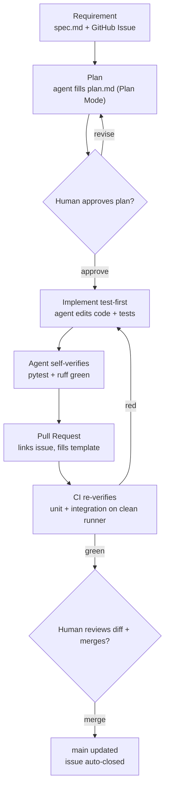

# Agentic SDLC — how this repo is built

This is a learning record of the agentic software-development loop used in this
project: how a feature goes from an idea to merged code, with an AI agent doing
the implementation and humans gating the important transitions. It maps to the
themes in GitHub's GH-600 (Agentic AI Developer) exam, but it is written as a
practical account of what was actually done here, not as exam notes.

## The mental model

Two roles run the loop:

- **Principal (you, the human).** Owns *intent* and *approval*. Decides what to
  build, judges whether a plan is right, and merges.
- **Delegate (the AI agent).** Owns *execution*. Reads the intent, writes the
  plan, writes the code and tests, and runs them.

The point of every artifact below — the spec, the plan, the tests, the PR — is
to make that delegation **verifiable**. At each gate the principal checks the
work against something concrete (a written criterion, a diff, a green check)
rather than trusting that the agent "probably got it right." Delegation without
verification is just hoping; the structure is what makes handing off safe.

## The loop at a glance

## Stage by stage

### 1. Requirement — `spec.md` + a GitHub Issue

A feature starts as a **spec written as testable acceptance criteria**, not as
implementation instructions. The principal specifies *what done looks like* and
leaves *how* to the agent.

- In-repo home: `specs/NNN-name/spec.md` (spec-driven-development style,
  numbered per feature).
- GitHub-native tracker: an Issue created from the same content, using the
  `.github/ISSUE_TEMPLATE/feature.md` template.

The discipline that matters: every criterion must be checkable by an automated
test. "A `thumbnails/` object is created, 150px longest side, and the metadata
gains a `thumbnail_key` field" is checkable; "call `img.resize`" is not. Testable
criteria are what later let both the agent and CI know the work is genuinely
done.

### 2. Plan — agent fills `plan.md` in Plan Mode

The single most important habit: **separate planning from doing.** The agent is
asked to propose a plan and explicitly *not* write code yet. In Claude Code,
**Plan Mode** enforces this — the agent can read and propose but cannot edit
files.

The agent explores the codebase, reads `AGENTS.md` and the spec, and writes the
plan into `specs/NNN-name/plan.md`: approach, files to change, test plan, risks,
and infrastructure impact.

### 3. Approval — the human gate

The returned plan is the **human-in-the-loop checkpoint**. The principal reads
it against the spec and the guardrails and either approves or sends it back with
corrections. This is the cheapest place to fix a misunderstanding, because no
code exists yet. Rubber-stamping defeats the purpose; reading the plan is the
entire value.

### 4. Implement — test-first

Once approved, the agent implements, writing the test that encodes a criterion
before the code that satisfies it (`AGENTS.md` instructs this). In Claude Code's
manual-approve mode, each file write is surfaced for a yes/no, so the principal
sees every change land and can catch scope creep (a write to a file outside the
plan is the signal to stop and look).

### 5. Verify — agent self-check, then PR, then CI

Verification happens in **layers**, deliberately:

1. **Agent self-check.** The agent runs `pytest` and `ruff` locally and
   fix-loops until green. The test suite is its own feedback signal.
2. **Pull request.** The agent opens a PR (never pushes to `main`), linking the
   issue with `Closes #N` and filling `.github/pull_request_template.md` so each
   criterion maps to the test that satisfies it.
3. **CI.** GitHub Actions re-runs the unit job and the LocalStack integration
   job on a clean machine, independent of the agent's local "green."

Three independent green signals before code reaches `main`: the agent's local
run, CI's clean-room run, and the human's review.

### 6. Merge — the final human gate

The principal reviews the diff and merges the PR. `Closes #N` auto-closes the
issue, completing the chain: **issue → spec → plan → branch → PR → CI → merge**,
fully traceable.

## The guardrails that make autonomy safe

Autonomy is only safe because the agent is bounded. `AGENTS.md` is read at the
start of every session (via `CLAUDE.md` → `@AGENTS.md`) and encodes the rules,
for example: never commit secrets, never push to `main`, keep the `uploads/`
event filter (or risk an infinite Lambda loop), keep the handler
environment-agnostic, and build before `terraform apply`. Every time the agent
does something that has to be corrected, the lesson goes back into `AGENTS.md` so
it does not recur.

## Two execution models

The same loop runs under two different agents; the scaffolding (`AGENTS.md`,
specs, tests, CI) is deliberately agent-agnostic so either can consume it.

- **Claude Code (local, in the IDE).** Tight, interactive loop — you watch it
  plan, approve, and see each test run. Best for *learning* how the gates feel,
  because you are in the cockpit.
- **GitHub Copilot coding agent (remote, assigned via an Issue).** Fully
  delegated and asynchronous — assign the issue, review a PR later. Leans harder
  on the written criteria being complete, since you are not there to course-
  correct mid-flight.

This repo's first feature was run through Claude Code.

## Worked example — the thumbnail feature

The first feature exercised the whole loop end to end:

1. **Spec.** `specs/001-thumbnail/spec.md` with seven acceptance criteria;
   created as GitHub Issue #1.
2. **Plan.** The agent (Plan Mode) explored the code and proposed the changes —
   correctly noting that the original bytes were already in memory (no second S3
   read), that `Image.thumbnail()` mutates in place so a fresh image is needed,
   and that the existing IAM `PutObject` wildcard already covered the new prefix.
3. **Approval with revisions.** Review caught a real gap: the test for the
   "no stretching" criterion only checked `max(side) <= 150`, which a stretched
   150x150 image would also pass. The revision required asserting the exact
   dimensions to prove aspect ratio was preserved. (This catch *is* the review
   skill the loop exists to practise.)
4. **Implement.** Test-first. During implementation the agent discovered Pillow
   rounds 112.5 *up* to 113, and corrected the expected size to `150x113` — the
   executable test catching a spec assumption.
5. **Verify.** Local tests green, PR #2 opened with `Closes #1`, CI green on both
   jobs.
6. **Merge.** PR merged, issue #1 auto-closed.

Note what a feature actually was: a small diff to existing files
(`handler.py`, the two test files, `infra/main.tf`) plus a new spec folder — not
a pile of new code files.

## What is deliberately *not* automated

- **Intent.** The principal writes the spec.
- **Plan approval.** A human reads and approves before code exists.
- **Merge.** A human reviews the diff and merges.
- **Production credentials and deploys.** Real-AWS credentials and
  `deploy-aws.sh` are run by the human, never the agent.

The agent accelerates execution; it does not own the decisions that are
expensive to get wrong.

## Running the next feature — checklist

1. Write `specs/NNN-name/spec.md` as testable acceptance criteria; open an Issue.
2. Ask the agent to plan in Plan Mode — no code. It fills `plan.md`.
3. Read the plan against the spec and `AGENTS.md`; approve or revise.
4. Let the agent implement test-first and self-verify to green.
5. Agent opens a PR with `Closes #N` and the filled template.
6. CI re-verifies; review the diff; merge.
7. If the feature involved a real architectural decision, add an ADR
   (`docs/adr/`).
