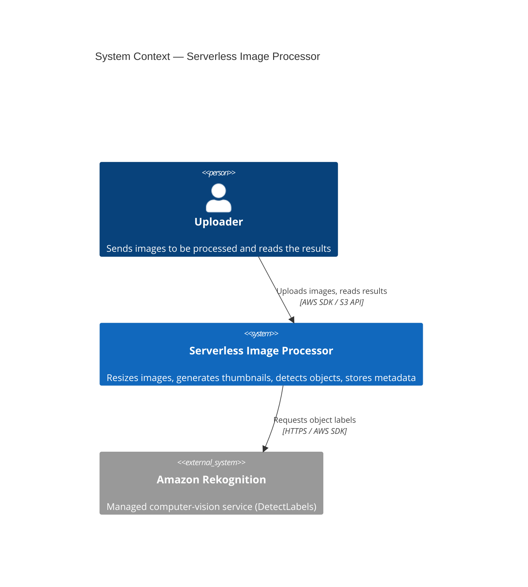
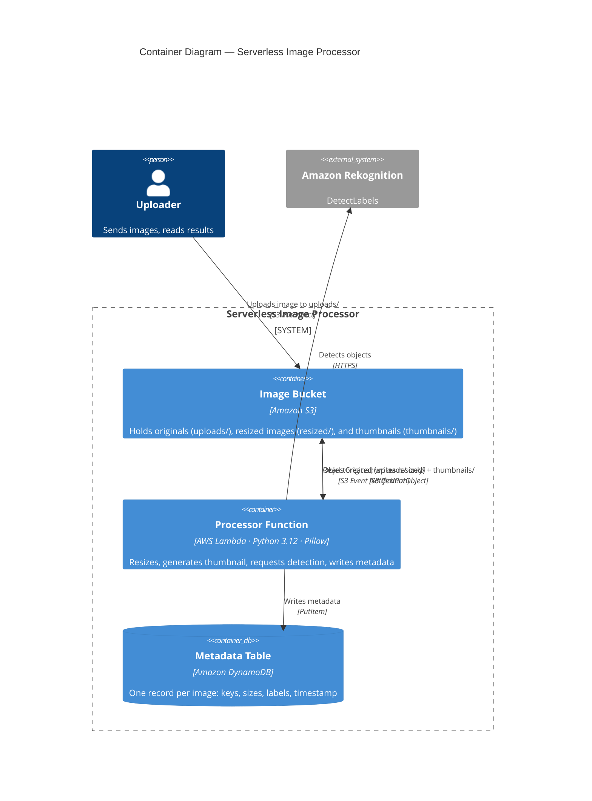
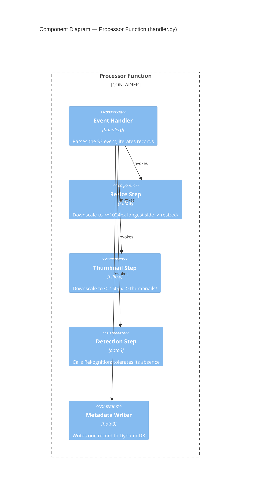

# Architecture

Architecture of the Serverless Image Processor, described with the
[C4 model](https://c4model.com/) at three zoom levels: System Context,
Container, and Component. Diagrams are Mermaid and render on GitHub.

> Note: Mermaid's C4 support is still experimental, so layout can be a little
> rough. If a diagram renders cramped, the element/relationship tables under
> each one describe the same thing in text.

## Level 1 — System Context

The big picture: who uses the system and what external services it depends on.

| Element | Type | Responsibility |
|---|---|---|
| Uploader | Person | Puts an image into the system and consumes the processed outputs |
| Serverless Image Processor | System | The thing this repo builds |
| Amazon Rekognition | External system | AWS-managed object detection, called at runtime |

## Level 2 — Container

The deployable/runtime pieces inside the system and how they interact.

| Container | Technology | Notes |
|---|---|---|
| Image Bucket | Amazon S3 | Single bucket, three prefixes. The event filter on `uploads/` is what stops the `resized/`/`thumbnails/` writes from re-triggering the function (see ADR 0002). |
| Processor Function | AWS Lambda, Python 3.12 | Stateless; the same code runs on LocalStack and AWS (see ADR 0003). |
| Metadata Table | Amazon DynamoDB | `image_key` partition key, `PAY_PER_REQUEST`. |

## Level 3 — Component

Inside the Processor Function — the steps within `handler.py`.

## Key runtime flow

1. Uploader writes an object under `uploads/`.
2. S3 emits an `ObjectCreated` event (only for the `uploads/` prefix).
3. The event invokes the Lambda.
4. The Lambda reads the original bytes once, then:
   - writes a resized copy to `resized/`,
   - writes a 150px thumbnail to `thumbnails/`,
   - calls Rekognition `DetectLabels` (skipped/empty when disabled),
   - writes a metadata record to DynamoDB.

## Deployment targets

The same Terraform in `infra/` deploys to two targets:

- **LocalStack** (local + CI) — via `tflocal`; Rekognition disabled.
- **Real AWS** (production) — via `terraform`; Rekognition enabled.

See ADR 0001 for the rationale and trade-offs.
